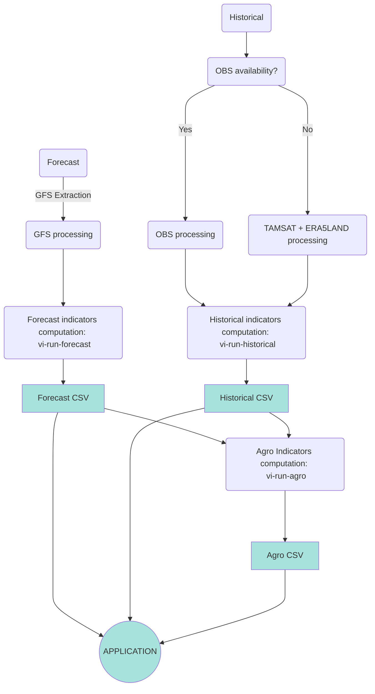

# VIGICLIMM Indicators

https://science-dev.pages.mfi.tls/nwp-processing/vigiclimm-indicators/

## Context

The VIGICLIMM program aims to modernize weather and climate services in Ivory Coast. One part of the project consists in developing an application that proposes indicators applied for rice production guidance. This package focuses on computing these weather and agricultural indicators.

Final users will be rice farmers. The information provided by these indicators will help to answer several topics such as:

- Determine ideal conditions for rice production activities feasibility, such as sowing, harvesting...
- Anticipate weather periods that favor fungal disease development
- Anticipate extreme weather events that impact rice growth and phenology

## Indicators

This package is divided into two main sections:

- `weather_indicators` module
  
  Write an comptute daily weather parameters, extreme events and other indicators such as ETP and GDD. Data is saved in CSV format.

- `agro_indicators` module
  
  Decision-making indicators for the different stages of rice production activities (sowing, harvesting,...).
  They take as input the weather parameters generated in the `weather_indicators` module.
  A risk disease indicator is also developed independantly.

  Data is saved in CSV format.

## How to use

Three CLI commands (defined in *pyproject.toml*) are available:

- `vi-run-forecast`: Compute and write weather indicators and raw forecasted parameters for all stations/locations of interest.
  

- `vi-run-historical`: Compute and write growing degree days and rainfall data for the current year for all stations/locations of interest.
  
- `vi-run-agro`: Compute and write agro indicators for all stations/locations of interest.
  

## Flowchart Diagram 

## For further information
About the project context and details of the indicators, please refer to this [Confluence page](https://mfi-poc.atlassian.net/wiki/spaces/CIV/pages/29556863/CIV+Suivi+D+veloppement+Indicateurs+Riz).

